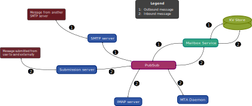

# The Pubsub Architecture of Talaria

At its core, Talaria is a messaging service. Clients require realtime updates
about the status of mailbox contents. The IMAP protocol implicitly expects
these realtime updates from a server and if we were every to create a web
frontend we would likely want to expose a websocket server for a real time
flow of message updates to clients.

The accommodate this requirement, a pubsub system sits at the center of the
architecture and all message update events are published there.

  

After an initial query to the mailbox service, a client should be able to
faithfully follow the state of the mailbox by _only_ listening to the
published events. This reduces the query load on the mailbox service and
helps decouple systems from one another.

## Published events

The following events are published

- `EventInbound` signals a new message destined for a users inbox. This is
published from the SMTP server accepting mail from other SMTP servers
- `EventOutbound` signals an outbound message from a user sent to the submission
server.
- `EventDeleted` signals the deletion of a message
- `EventUpdated` signals a change to the mutable metadata (imap flags,
mailbox etc) of a message